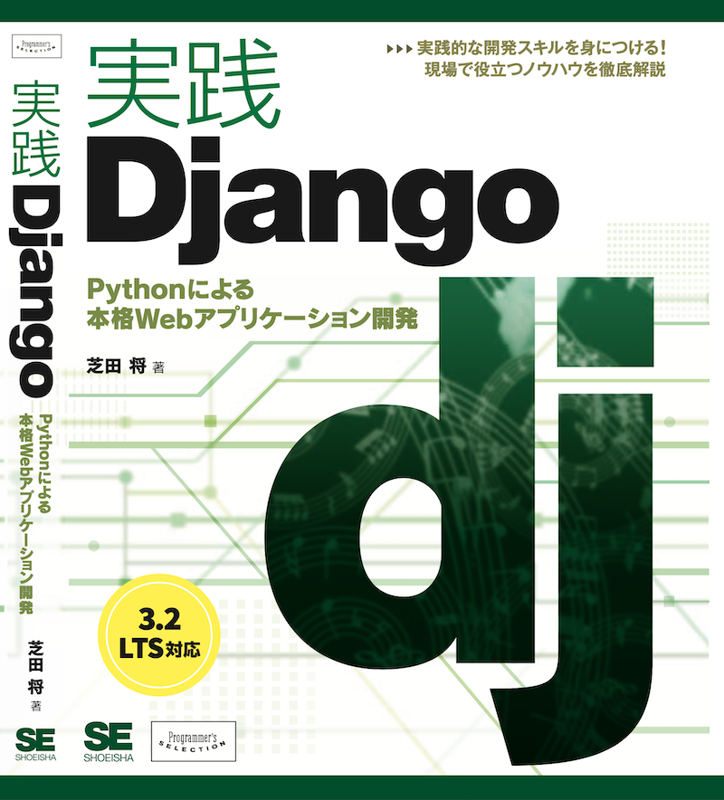

# 実践Django Pythonによる本格Webアプリケーション開発

書籍「実践Django Pythonによる本格Webアプリケーション開発 (翔泳社)」のサンプルコードです。
[目次はこちら](./contents.md)からご覧いただけます。

* [Amazon.co.jp 商品ページ](https://www.amazon.co.jp/dp/4798153958/)
* [翔泳社 商品ページ](https://www.shoeisha.co.jp/book/detail/9784798153964)

## ソフトウェアのバージョン

本書の執筆にあたり、PythonおよびDjangoは以下のバージョンで動作確認を行いました。

* Python 3.9
* Django 3.2

読者のみなさんは、できるかぎり最新のバージョンを使うことを推奨しています。もしかすると今後Djangoの新しいバージョンがリリースされたときに、本書のコードが動かなくなってしまうかもしれませんが、Djangoのソースコードやリリースノートを読みながら動かなくなった原因を探り、修正する過程で得られる知識は無駄にならないはずです。ぜひチャレンジしてみてください。

## 本書の内容に関する指摘や誤字の報告

もし本書の内容や誤字・誤植に関する指摘が見つかった際は、本書サポートページの問い合わせ欄からご連絡ください。
サポートページURLは https://www.shoeisha.co.jp/book/detail/9784798153964 です。

本書の内容に関する技術的な指摘は、出版社を経由するとやりとりが難しいこともあるかと思います。
そういった議論が必要な技術的なご指摘は、GitHub Issueを作成いただければと思います。

## 著者連絡先

* GitHub: [@c-bata](https://github.com/c-bata)
* Twitter: [@c_bata_](https://twitter.com/c_bata_)

